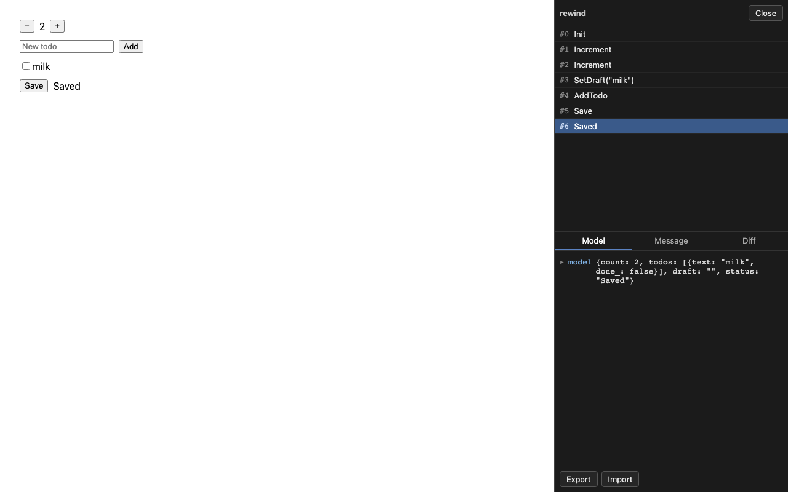
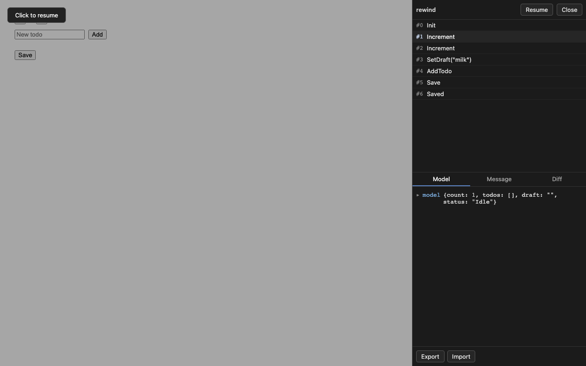
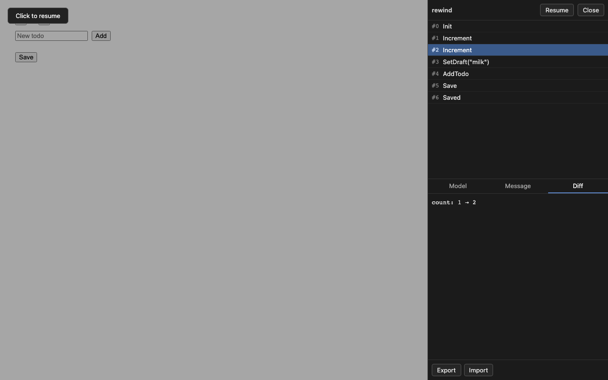
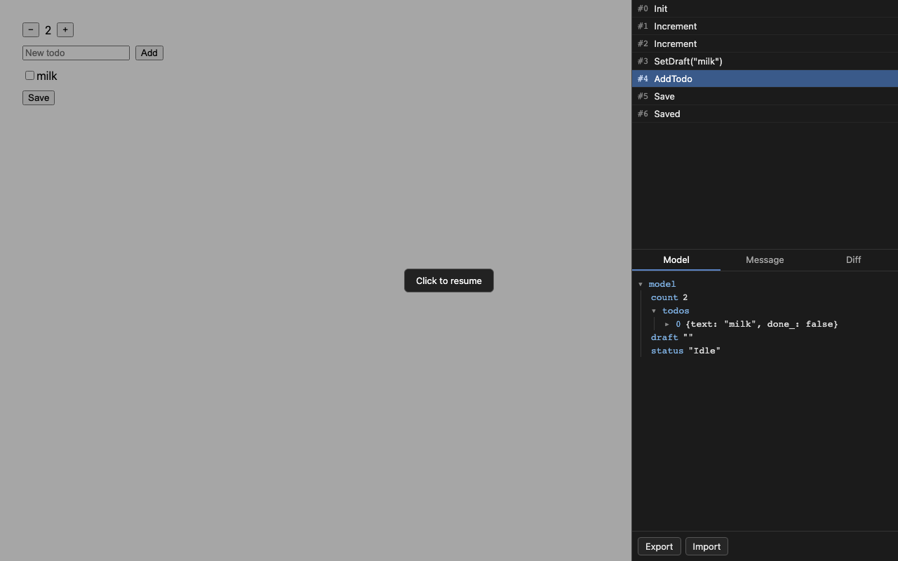
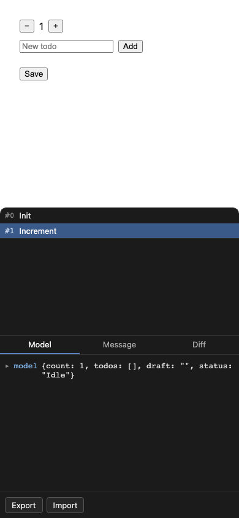

# rescript-rewind

rewind is an Elm-style time-travel debugger for ReScript React apps. It
records each message and each model. Then a developer can pause a running
app and step through its history. rewind copies these parts of the
`elm/browser` debugger:

- a paused view of any past state
- a jump to any recorded state, by index
- an export and an import of a message log, as JSON
- a capped history, so a long session does not use unlimited memory
- a badge that shows the current message count
- a list of past messages, one row for each step
- three views for the selected entry: Model, Message, and Diff
- a full-screen blocker while paused, that blocks input the way Elm's `BlockAll` does
- a click on the blocker, that resumes the live view
- Import and Export controls, shown only when the app supplies a codec

See [DESIGN.md](./DESIGN.md) for the full design.

## Screenshots







## Install

Add rewind as a git dependency, pinned to one commit:

```json
{
  "dependencies": {
    "rescript-rewind": "github:m0n01d/rewind#<commit>"
  }
}
```

Add `"rescript-rewind"` to the `dependencies` list in your `rescript.json`:

```json
{
  "dependencies": ["rescript-rewind"]
}
```

rewind needs these peer dependencies:

- `rescript` >=12.3.0
- `@rescript/react` >=0.15.0
- `react` >=19
- `react-dom` >=19

## Use

```res
type model = {count: int, saving: bool}
type msg = Increment | Save | Saved

let reduce = (model: model, msg: msg): model =>
  switch msg {
  | Increment => {...model, count: model.count + 1}
  | Save => {...model, saving: true}
  | Saved => {...model, saving: false}
  }

@react.component
let make = () => {
  let rewind = Rewind.use(reduce, {count: 0, saving: false})

  // Reads `rewind.live`, not `rewind.model` -- see the note below.
  React.useEffect1(() => {
    if rewind.live.saving {
      let id = setTimeout(() => rewind.dispatch(Saved), 800)
      Some(() => clearTimeout(id))
    } else {
      None
    }
  }, [rewind.live.saving])

  let model = rewind.model
  <div>
    <span> {React.string(Int.toString(model.count))} </span>
    <button onClick={_ => rewind.dispatch(Increment)}> {React.string("+1")} </button>
    <button onClick={_ => rewind.dispatch(Save)}> {React.string("Save")} </button>
  </div>
}
```

A React hook built on rewind returns two models: `model` and `live`. Render
`model` in your view, so a paused view shows the paused entry, not the live
one. Read `live` in an effect, not `model`, so a paused view cannot fire
that effect again.

## Dev Only

Pass `~enabled` from your bundler's dev flag, so rewind only records in
development. With Vite, bind the flag like this:

```res
@val external viteDev: bool = "import.meta.env.DEV"
```

Then pass it to `Rewind.use`:

```res
let rewind = Rewind.use(~enabled=viteDev, reduce, {count: 0, saving: false})
```

## Export and Import

Pass `~codec` to `Rewind.use`, so the panel can export and import this
session's message log as JSON. Without a codec, the panel hides the Export
and Import controls.

A codec is a pair of pure functions. `encode` turns one message into JSON.
`decode` turns JSON back into a message, or into an error. A message that
holds a `Blob` or a function cannot have a codec, because neither converts
to JSON.

## Limits

Version 0 of rewind does not cover these five things:

- skip messages, to leave one recorded message out of a replay
- a command runtime, such as Elm's `Cmd`
- a publish of this package to npm
- state that survives a page reload
- printing for `Belt.Map` and similar tree-based collections

rewind's printer also cannot always tell some values apart, because
ReScript compiles them to the same runtime shape:

- `Some(x)` and `x` itself
- a nullary constructor, such as `Red`, and a plain string
- a tuple and an array
- `list{}`, the empty list, and the number `0`
- `unit` and `None`

This is a limit of runtime reflection, not a bug rewind can fix. A codec
that the app writes does not have this problem.

## Develop

Run these commands from the project root:

```sh
npm install
npm test
npm run demo
```

`npm test` builds the library and runs every test file. `npm run demo`
starts the demo app on port 5199.
